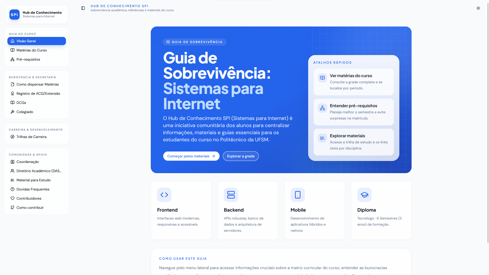
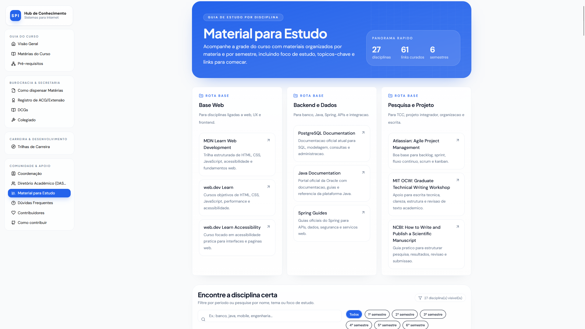
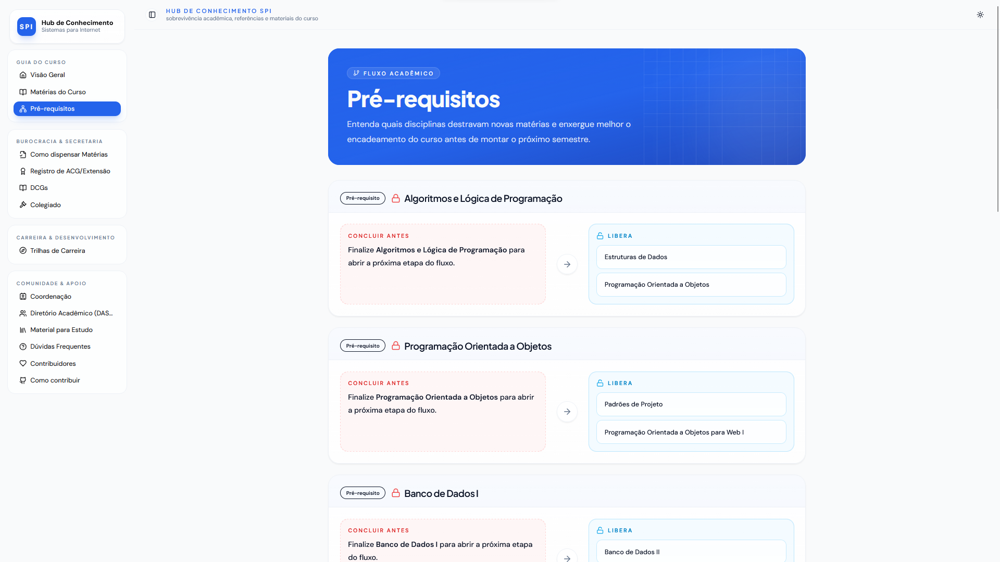
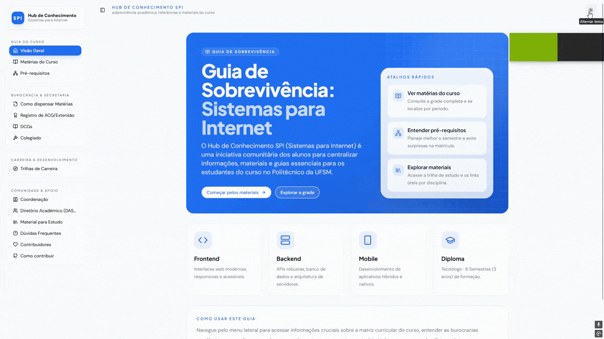

# Hub de Conhecimento SPI

Portal academico criado para centralizar informacoes uteis para estudantes do curso de Tecnologia em Sistemas para Internet.

O projeto reune conteudos sobre grade curricular, pre-requisitos, dispensas, ACG/DCG/extensao, colegiado, coordenacao, materiais de estudo, trilhas de carreira e paginas de apoio a comunidade do curso.



## Visao Geral

O Hub de Conhecimento SPI funciona como uma aplicacao web com frontend em React/Vite e um backend Express enxuto, usado principalmente para servir a aplicacao e sustentar o fluxo de desenvolvimento e build.

Hoje o conteudo e majoritariamente estatico e mantido no proprio repositorio, com foco em:

- reduzir a dispersao de informacoes academicas;
- facilitar a vida de calouros e veteranos;
- concentrar guias, referencias e materiais em um unico lugar;
- permitir evolucao rapida do conteudo sem depender de sistemas externos.

## Preview

### Materiais de Estudo



### Pre-requisitos



### Navegacao



## Principais Secoes

- Visao geral do curso
- Materias do curso
- Pre-requisitos
- Como dispensar materias
- Registro de ACG, DCG e extensao
- DCGs
- Colegiado
- Coordenacao
- Diretorio Academico
- Material para estudo
- Duvidas frequentes
- Trilhas de carreira
- Contribuidores e pagina de contribuicao

## Stack

- React 18
- TypeScript
- Vite
- Express
- Tailwind CSS
- shadcn/ui
- Radix UI
- Wouter
- Framer Motion
- Vercel Analytics

## Estrutura do Projeto

```text
client/
  src/
    components/   # componentes de UI e layout
    hooks/        # hooks compartilhados
    lib/          # dados estaticos, utilitarios e configuracao
    pages/        # paginas da aplicacao
server/           # servidor Express e integracao com o build
script/           # scripts de build
docs/
  images/         # previews usadas na documentacao
```

## Como Rodar Localmente

### Pre-requisitos

- Node.js 18+ recomendado
- npm

### Instalacao

```bash
npm install
```

### Desenvolvimento

```bash
npm run dev
```

O projeto sobe a aplicacao em modo de desenvolvimento com servidor Node + Vite.

Por padrao, a porta utilizada e definida por `PORT`. Na ausencia dessa variavel, o projeto usa a porta `3000`.

### Build de Producao

```bash
npm run build
```

### Executar Build

```bash
npm run start
```

### Checagem de Tipos

```bash
npm run check
```

## Scripts Disponiveis

- `npm run dev`: inicia o ambiente de desenvolvimento
- `npm run build`: gera o build de producao do cliente e do servidor
- `npm run start`: executa a versao buildada
- `npm run check`: roda o TypeScript para validacao estatica

## Conteudo e Manutencao

Grande parte do conteudo atualmente esta centralizada em arquivos estaticos dentro de `client/src/lib`, com destaque para:

- `client/src/lib/mock-data.ts`
- `client/src/lib/study-guides.ts`

Isso torna o projeto simples de manter e facilita contribuicoes de conteudo, revisao de textos e atualizacao de informacoes academicas.

## Design e Experiencia

O projeto utiliza uma interface SPA com navegacao lateral, suporte a tema claro/escuro e paginas com foco em legibilidade, hierarquia visual e acesso rapido a informacao.

## Contribuicao

Contribuicoes sao bem-vindas, especialmente para:

- correcao de informacoes desatualizadas;
- melhoria de textos e organizacao de conteudo;
- refinamentos de interface e experiencia;
- adicao de novos guias e materiais uteis para o curso.

Para orientacoes praticas, consulte a pagina `Como contribuir` dentro da aplicacao ou abra uma issue / pull request neste repositorio.

## Licenca

Este repositorio utiliza a licenca `MIT`.
